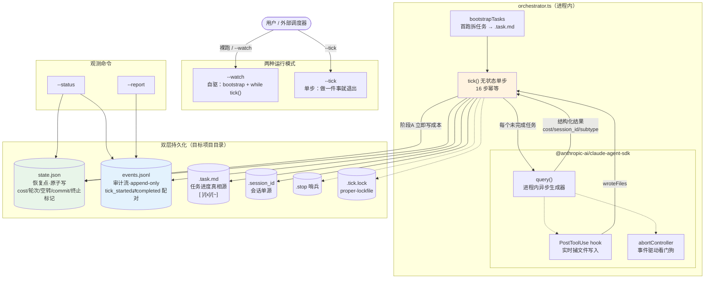
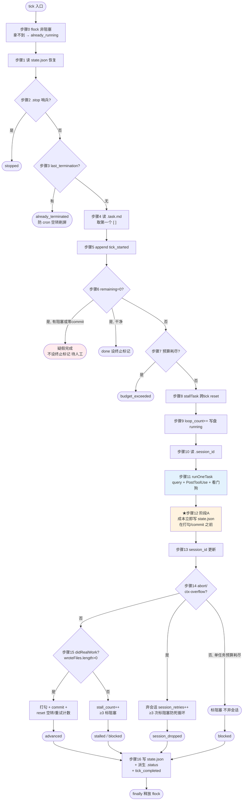
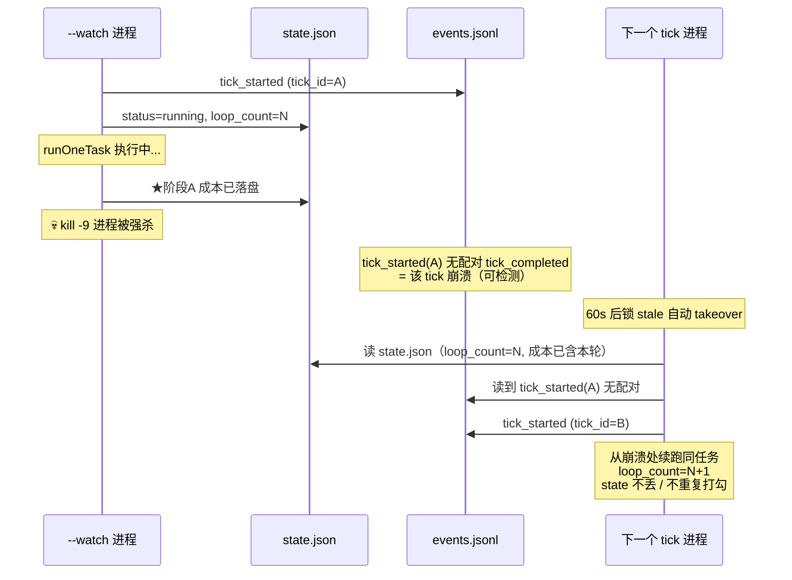

# loop-orchestrator

24 小时无人值守开发 orchestrator —— 用 `@anthropic-ai/claude-agent-sdk` 的 `query()` 驱动 Claude 自主完成一整个开发目标。

> 核心理念：**重但稳 + 使用简单**。长跑拆成幂等单步 `tick`，状态双层落盘，进程崩溃天然可恢复；用户视角只一条命令跑到底，调度器中立不绑任何外部 agent。

```bash
# 一条命令跑通：拆任务 + 自动推进到完成 + 自动 commit
npx tsx orchestrator.ts --cwd /path/to/project "构建一个 Go REST API"
```

---

## 架构图

### 整体：tick 化 + 双层持久化 + 调度器中立



### tick() 16 步控制流（崩溃恢复核心）



### 崩溃恢复时序



---

## 快速开始

```bash
# 1. 装依赖（一次）
npm install

# 2. 跑（产物写在 --cwd 指定的项目目录）
npx tsx orchestrator.ts --cwd /path/to/project "构建一个 Go REST API"
```

## 命令一览

| 命令 | 作用 |
|---|---|
| `orchestrator.ts --cwd <proj> "目标"` | 裸跑 = `--watch`，自驱跑到完成 |
| `--watch "目标"` | 显式自驱（bootstrap + `while(tick)`） |
| `--tick` | 单步，幂等可恢复（给调度器用） |
| `--status` | 实时状态（读 state.json + events.jsonl） |
| `--report` | 运行报告 |
| `--stop` | 停（写 `.stop` 哨兵 + 杀 `--watch`） |
| `--resume` | 清 `.stop` 哨兵恢复 |

`--cwd` 决定三件事，三者统一：① 产物写入处 ② `git commit` 的仓库 ③ 会话工作目录。不传则回退当前目录。**别在 loop 仓库根目录裸跑**——会把产物写进 loop 仓库并 commit 它。

---

## 两种运行模式

- **`--watch`（自驱）**：`bootstrapTasks` 拆任务 → `while(tick())` 跑到完成/停止/预算耗尽。长进程，命令行直跑用。终止类 outcome（done/budget_exceeded/already_terminated/stopped）break；already_running 退避 30s；其余 5s。
- **`--tick`（单步）**：取第一个未完成任务 → 执行 → 打勾/标阻塞 → commit → 退出。幂等、可随时 kill、kill 了下次接上。给外部调度器用。

## 调度器中立（tick 是接口）

orchestrator 不绑定任何调度器。`--tick` 是标准接口，任意能定时跑命令的都能驱动：

```bash
# 系统 crontab 每 5 分钟推进一步
*/5 * * * * cd /path/to/project && tsx /path/to/orchestrator.ts --tick >> night_run.log 2>&1

# 或 hermes cron / systemd timer / 另一个会话手敲 —— 都行
```

接哪个调度器是独立工作，orchestrator 本身不改。

---

## 稳定性设计（核心：成熟库兜底，不手写）

| 机制 | 实现 | 防什么 |
|---|---|---|
| 原子写 | `write-file-atomic`（data fsync + dir fsync） | state.json/.task.md 写一半被 kill 截断 |
| 进程级锁 | `proper-lockfile`（stale 60s 自动 takeover） | `--tick` 与 `--watch` / 手动与 cron 并发冲突；kill -9 残留锁 |
| **阶段A 财务保护** | runOneTask 返回立即写成本，在打勾/commit 之前 | 崩溃丢钱、预算守卫漏算超支 |
| 假完成三重校验 | 零改动不打勾 + 连续 3 次空转标阻塞 + 全程零 commit 不退出 | agent 空退/假完成 |
| ctx-overflow 重试 | 结构化判定（subtype+errors）+ 弃会话重开，连续 3 次标阻塞 | 上下文撑爆死循环 |
| 崩溃检测 | tick_started 与 tick_completed 配对（同 tick_id） | 发现未完成的崩溃 tick |

## 持久化文件

| 文件 | 作用 |
|---|---|
| `state.json` | 机器读恢复点（原子写）：成本/轮次/空转/commit/终止标记 |
| `events.jsonl` | append-only 审计流，`--status`/`--report` 从它读 |
| `.task.md` | 任务列表 + 勾选状态（`[ ]`/`[x]`/`[~]`）——进度真相源 |
| `.session_id` | Claude 会话 ID（单源，不进 state.json） |
| `.stop` | 停止哨兵（`--stop` 写，`--resume` 删） |
| `.tick.lock` | 进程级并发锁 |
| `night_run.log` | 人类可读文本日志 |

## 上下文管理（SDK 自带）

`autoCompactEnabled` 默认 true：上下文快满自动压成摘要，会话不中断、`session_id` 不变。真撑爆了（query 报 `error_during_execution` 含 context）→ 弃会话重开。orchestrator 这层不用管上下文。

---

## 核心机制

- 进程内 `query()`，结构化结果直出（不再 spawn `claude -p` 子进程 grep stream-json）
- `PostToolUse` hook 实时捕获真实文件写入 → 完成判定看真实事件（不靠 `git diff` 猜）
- `abortController` + `Stop` hook 刷新心跳 → 看门狗事件驱动，不轮询
- `disallowedTools` 移除 `EnterPlanMode`/`ExitPlanMode`/`AskUserQuestion`（防卡住）
- `maxBudgetUsd` 单任务 + 全程双护栏
- 会话策略：首轮新会话、后续 resume、**永不 continue**（防旧会话污染）
- 每轮自动 commit（本地不 push），带 Co-Authored-By trailer

## 验证

- e2e happy path：2 任务全跑通、2 commit、events 配对完整、state.json 正确
- **崩溃恢复**：`kill -9` 后 state.json 完好、.task.md 未误打勾、锁 stale 自动 takeover、loop_count 不丢、下次 tick 从崩溃处续跑
- flock 并发：两个 `--tick` 同时，第二个立即 already_running
- `--stop` 哨兵：watch 收 SIGTERM 退出 + 写 .stop，`--resume` 恢复
- 假完成守卫：全 `[x]` 零 commit → 疑假完成，不设 last_termination 待人工介入

## 文件

| 文件 | 作用 |
|---|---|
| `orchestrator.ts` | 主程序（tick + watch + state/events 持久化） |
| `write-file-atomic.d.ts` | write-file-atomic v7 的 ambient 类型声明 |
| `package.json` / `tsconfig.json` | 依赖（proper-lockfile + write-file-atomic）与类型配置 |

## 依赖

| 依赖 | 用途 |
|---|---|
| `@anthropic-ai/claude-agent-sdk` | 进程内 query() + hooks |
| `proper-lockfile` | 进程级并发锁（stale takeover） |
| `write-file-atomic` | 原子写（崩溃不截断） |
| `node:util` parseArgs | CLI 解析（零依赖内置） |
| `tsx` / `typescript`（dev） | 运行/类型检查 |
