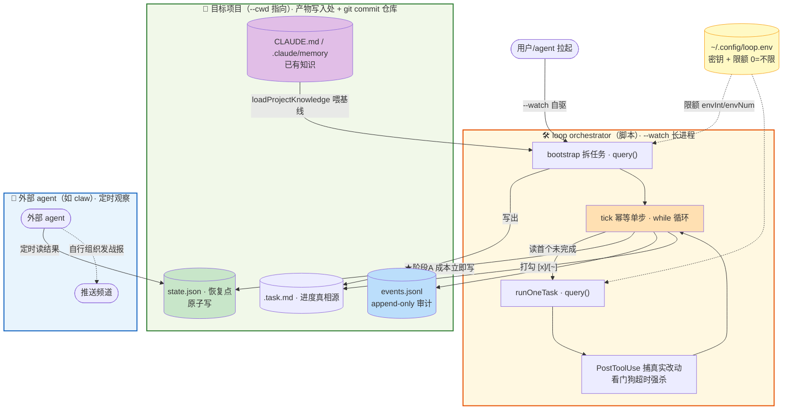
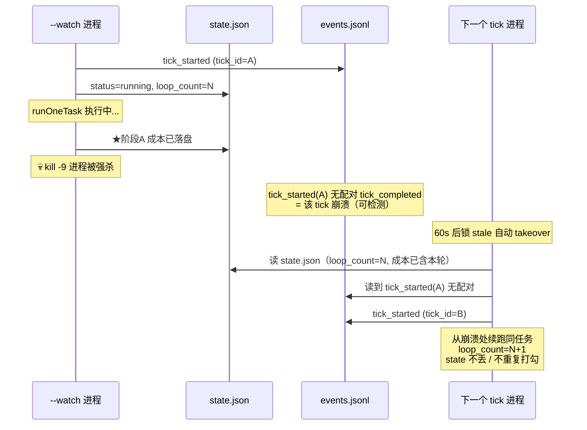

# loop-orchestrator

24 小时无人值守开发 orchestrator —— 用 `@anthropic-ai/claude-agent-sdk` 的 `query()` 驱动 Claude 自主完成一整个开发目标。

> 核心理念：**重但稳 + 使用简单**。长跑拆成幂等单步 `tick`，状态双层落盘，进程崩溃天然可恢复；orchestrator 只管推进 + 结果结构化落盘，战报由外部 agent 读结果自行发送。

## 安装

两种入口，装的是同一个 `install.sh`——按你是人还是智能体挑一个：

### 方式一 · `.sh`：一条命令（人 / 智能体直接执行）

```bash
curl -fsSL https://raw.githubusercontent.com/free-wyq/loop/main/install.sh | bash
```

### 方式二 · `.md`：给智能体读（它读完自行装）

把这个地址发给你的 AI 助手：

```
https://raw.githubusercontent.com/free-wyq/loop/main/install.md
```

让它读这个文档、按文档执行上面的 bash 即可装好。适合让 agent 自主配置、或不想手动敲命令的场景。

---

两种方式都装到中立路径（不碰任何 agent 私有目录），装完即用 `loop --cwd <项目> "目标"`。卸载/重装/升级见 [install.md](install.md)。

---

## 架构图

### 整体：推进 + 结果结构化落盘 + 外部 agent 读结果发战报



三个边界一图看清：
- 📁 **项目边界（绿框）**——`--cwd` 指向的目标项目：已有知识（CLAUDE.md/memory）+ 全部产物（.task.md/state.json/events.jsonl）都落在它目录里，git commit 进它仓库。
- 🛠️ **脚本边界（橙框）**——loop orchestrator 本体（`orchestrator.ts` 的 `--watch` 进程）：bootstrap 拆解 + tick 执行是两个独立 `query()`，都吃配置层限额。
- 📡 **外部 agent 边界（蓝框）**——定时读项目里**已落盘**的结果自行组织发战报，与脚本互不依赖（任一方挂了不影响另一方）。
- ⚙️ 配置（黄）`~/.config/loop.env` 在中立路径，启动时读进 env（不属脚本也不属项目）。

### tick() 控制流（崩溃恢复核心，watch 内部循环调用）


### 崩溃恢复时序



---

## 快速开始

```bash
# 1. 一条命令安装（agent 无关，装到 ~/.local）
curl -fsSL https://raw.githubusercontent.com/free-wyq/loop/main/install.sh | bash

# 2. 配密钥（非交互调度器不 source ~/.bashrc，写进 loop.env 才拿得到）
cp ~/.local/share/loop/loop.env.example ~/.config/loop.env
chmod 600 ~/.config/loop.env   # 编辑填 ANTHROPIC_API_KEY=sk-...（走代理再加 ANTHROPIC_BASE_URL/ANTHROPIC_MODEL）

# 3. 跑（产物写在 --cwd 指定的项目目录）
loop --cwd /path/to/project "构建一个 Go REST API"
```

### 配置（密钥 / 代理 / 限额）

cron / systemd / hermes cron 跑**干净 env 不 source `~/.bashrc`**，密钥得写进 `~/.config/loop.env`，orchestrator 启动自动读（已 export 的不覆盖）。限额默认全 `0 = 不限`（自托管/免费代理模型没有按量计费，预算护栏纯属挡路），要护栏再在 `loop.env` 设正数。详见 [install.md](install.md)。

| 变量 | 默认 | 含义 |
|---|---|---|
| `ANTHROPIC_API_KEY` | — | 鉴权（写进 loop.env） |
| `ANTHROPIC_BASE_URL` | 官方 | 走代理/中转才填 |
| `ANTHROPIC_MODEL` 等 | — | 走代理时指定模型名 |
| `LOOP_MAX_TURNS` | 0（不限） | 单任务最大轮数 |
| `LOOP_MAX_BUDGET_PER_TASK` | 0（不限） | 单任务美元上限 |
| `LOOP_MAX_BUDGET_TOTAL` | 0（不限） | 全程美元上限 |
| `LOOP_BOOTSTRAP_MAX_TURNS` / `LOOP_BOOTSTRAP_MAX_BUDGET` | 0（不限） | bootstrap 拆解限额 |
| `LOOP_STALL_LIMIT` | 3 | 同任务连续零改动 N 次标阻塞 |
| `LOOP_ABORT_TIMEOUT_MIN` | 60 | 单任务超 N 分钟无进展则 abort |
| `LOOP_SESSION_RETRY_LIMIT` | 3 | 当前任务连续 ctx 撑爆 N 次标阻塞 |

## 命令一览

| 命令 | 作用 |
|---|---|
| `loop --cwd <proj> "目标"` | 裸跑 = `--watch`，自驱跑到完成 |
| `loop --cwd <proj> --watch "目标"` | 显式自驱（bootstrap + `while(tick)`） |
| `loop --cwd <proj> --status` | 实时状态（多行，读 state.json + events.jsonl） |
| `loop --cwd <proj> --report` | 运行报告 |
| `loop --cwd <proj> --stop` | 停（写 `.stop` 哨兵 + 杀 `--watch`） |
| `loop --cwd <proj> --resume` | 清 `.stop` 哨兵恢复 |

`--cwd` 决定三件事，三者统一：① 产物写入处 ② `git commit` 的仓库 ③ 会话工作目录。不传则回退 `LOOP_PROJECT` 环境变量或当前目录。**别在 loop 仓库根目录裸跑**——会把产物写进 loop 仓库并 commit 它。

> 未装 `loop` 命令、直接在 loop 仓库内开发时，`loop` 等价于 `npx tsx orchestrator.ts`。

---

## 推进 + 结构化结果 + 外部发战报

- **推进**：`--watch` 长进程，一次拉起自驱跑到完成。内部是幂等 `tick()`（bootstrap 拆任务 → `while(tick())`，每轮 commit），崩了重启续跑。推进不依赖外部触发。
- **结果落盘**：每轮把进度/成本/状态结构化写进 `state.json`（恢复点，原子写）+ `events.jsonl`（append-only 审计流）。`.task.md` 是进度真相源。
- **战报**：orchestrator **不发**。由外部 agent 定时读 state/events/.task.md 这些结构化结果，自行组织文案发战报。文案、频道、频率全由 agent 定。

三者解耦：推进靠 `--watch` 自管，结果可靠落盘，战报由外部 agent 读结果自行组织。watch 挂了不影响外部 agent 读已落盘的结果发战报；外部 agent 挂了不影响 watch 推进。

```bash
# 推进（一次）
loop --cwd /path/to/project "构建一个 Go REST API"

# 外部 agent 定时读结果发战报（由该 agent 的定时机制实现，读结构化文件即可）
#   cat /path/to/project/state.json
#   tail -8 /path/to/project/events.jsonl
```

战报怎么发是独立工作，orchestrator 本身不改、也不掺和。

## 注册成 skill（可选，agent 自行推理）

`skill/` 是一个可被 agent 加载的 skill（含 `SKILL.md`）。多数 agent 的 skill 扫描器用 find/glob 遍历 skills 目录、**默认不跟符号链接进子目录**——symlink 进去的 skill 扫描器看不见。所以注册时**拷成真目录**而非 symlink：

```bash
# 推理你 agent 的 skills 目录（常见：~/.claude/skills · ~/.codex/skills · ~/.gemini/skills · ~/.cursor/skills · ~/.hermes/skills）
SKILLS_DIR=~/.claude/skills
mkdir -p "$SKILLS_DIR"; rm -rf "$SKILLS_DIR/loop-scheduler"
cp -r ~/.local/share/loop/skill "$SKILLS_DIR/loop-scheduler"
# 验证扫描器能看到：find "$SKILLS_DIR/loop-scheduler" -name SKILL.md   # 应返回一行
```

loop 升级后重跑上述命令刷新 skill 内容。详见 [install.md](install.md)。

---

## 稳定性设计（核心：成熟库兜底，不手写）

| 机制 | 实现 | 防什么 |
|---|---|---|
| 原子写 | `write-file-atomic`（data fsync + dir fsync） | state.json/.task.md 写一半被 kill 截断 |
| 进程级锁 | `proper-lockfile`（stale 60s 自动 takeover） | 多 watch / 手动与 watch 并发冲突；kill -9 残留锁 |
| **阶段A 财务保护** | runOneTask 返回立即写成本，在打勾/commit 之前 | 崩溃丢钱、预算守卫漏算超支 |
| 假完成三重校验 | 零改动不打勾 + 连续 3 次空转标阻塞 + 全程零 commit 不退出 | agent 空退/假完成 |
| ctx-overflow 重试 | 结构化判定（subtype+errors）+ 弃会话重开，连续 3 次标阻塞 | 上下文撑爆死循环 |
| 崩溃检测 | tick_started 与 tick_completed 配对（同 tick_id） | 发现未完成的崩溃 tick |

## 持久化文件

| 文件 | 作用 |
|---|---|
| `state.json` | 机器读恢复点（原子写）：成本/轮次/空转/commit/终止标记 |
| `events.jsonl` | append-only 审计流，`--status`/`--report` 从它读 |
| `.task.md` | 任务列表 + 勾选状态（`[ ]`/`[x]`/`[~]`）——进度真相源 |
| `.session_id` | Claude 会话 ID（单源，不进 state.json） |
| `.stop` | 停止哨兵（`--stop` 写，`--resume` 删） |
| `.tick.lock` | 进程级并发锁 |
| `night_run.log` | 人类可读文本日志 |

## 上下文管理（SDK 自带 + prompt 节流）

`autoCompactEnabled` 默认 true：上下文快满自动压成摘要，会话不中断、`session_id` 不变。真撑爆了（query 报 `error_during_execution` 含 context）→ 弃会话重开。

### bootstrap 知识优先 + 按需探索（防拆任务爆上下文）

旧设计让 LLM 自己 agentic 探索项目拿上下文 → 要么探索过度爆上下文（Claude Code 拆得准但爆）、要么没上下文纯猜（Hermes 拆得不准）。根因是「谁拿项目上下文」绑在 LLM 身上。

改法：**把最高价值的现成知识由 orchestrator 代码直接读出来喂进 prompt 当基线，模型拿这些做底，剩余按需自己探索——不限制死，只把它从「无脑全扫」掰向「已知为基、按需补」。** 基线优先级：

1. `CLAUDE.md`（claude code 沉淀的项目说明书，密度最高）
2. `.claude/memory/*.md` 累积记忆（跳过 `progress.md` 流水账）
3. 退路：都没有时代码轻量勘察目录树（限深 3 层 + manifest，跳依赖/构建产物大目录、保留隐藏文件）当探索起点，总长截断 20k

**不锁死文件工具**：CLAUDE.md/memory 当基线喂进来，剩下细节模型按需 Read/Grep——无脑全扫才爆上下文，按需探索不会。旧工程复用已有知识、不重扫；真新工程走退路给个地图当起点。Hermes 以前不准就是没上下文，现在基线喂进去了，谁拆都准。

⚠️ GLM 等代理模型上下文只有 ~300k。worker prompt 已加节流铁律：只读与当前任务相关的文件、复用 `.claude/memory/` 已有背景、大文件 Grep 定位再按行 Read。目标项目可放 `.claudeignore` 进一步压扫描范围。orchestrator 这层不手管上下文。

---

## 核心机制

- 进程内 `query()`，结构化结果直出（不再 spawn `claude -p` 子进程 grep stream-json）
- `PostToolUse` hook 实时捕获真实文件写入 → 完成判定看真实事件（不靠 `git diff` 猜）
- `abortController` + `Stop` hook 刷新心跳 → 看门狗事件驱动，不轮询
- `disallowedTools` 移除 `EnterPlanMode`/`ExitPlanMode`/`AskUserQuestion`（防卡住）
- 预算/轮数护栏默认关（`0 = 不限`），走付费模型再在 `loop.env` 设正数（单任务 + 全程双护栏）
- 会话策略：首轮新会话、后续 resume、**永不 continue**（防旧会话污染）
- 每轮自动 commit（本地不 push），带 Co-Authored-By trailer
- 日志用本地时间（跟随系统时区 / `TZ`），不再 `toISOString()` 输出 UTC

## 验证

- e2e happy path：2 任务全跑通、2 commit、events 配对完整、state.json 正确
- **崩溃恢复**：`kill -9` 后 state.json 完好、.task.md 未误打勾、锁 stale 自动 takeover、loop_count 不丢、下次 tick 从崩溃处续跑
- flock 并发：两个 watch 同时，第二个立即 already_running
- `--stop` 哨兵：watch 收 SIGTERM 退出 + 写 .stop，`--resume` 恢复
- 假完成守卫：全 `[x]` 零 commit → 疑假完成，不设 last_termination 待人工介入

## 文件

| 文件 | 作用 |
|---|---|
| `orchestrator.ts` | 主程序（tick + watch + state/events 持久化） |
| `write-file-atomic.d.ts` | write-file-atomic v7 的 ambient 类型声明 |
| `package.json` / `tsconfig.json` | 依赖（proper-lockfile + write-file-atomic）与类型配置 |

## 依赖

| 依赖 | 用途 |
|---|---|
| `@anthropic-ai/claude-agent-sdk` | 进程内 query() + hooks |
| `proper-lockfile` | 进程级并发锁（stale takeover） |
| `write-file-atomic` | 原子写（崩溃不截断） |
| `node:util` parseArgs | CLI 解析（零依赖内置） |
| `tsx` / `typescript`（dev） | 运行/类型检查 |
